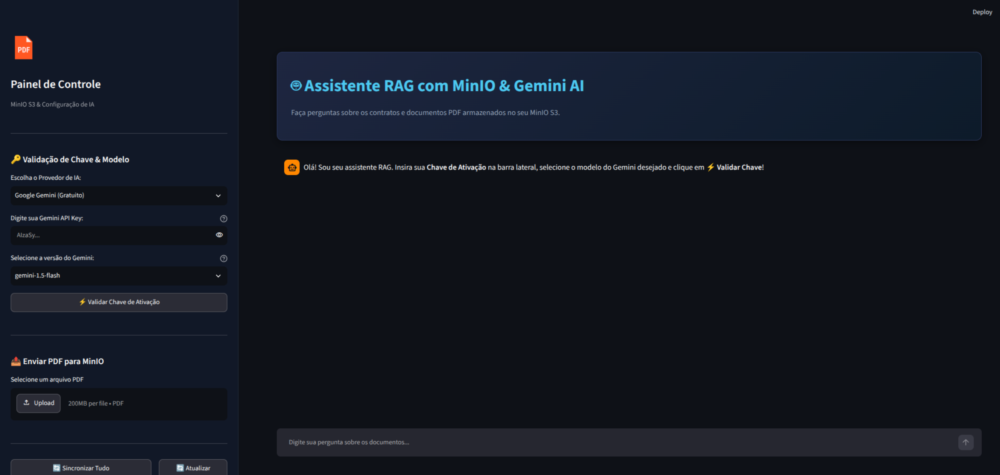
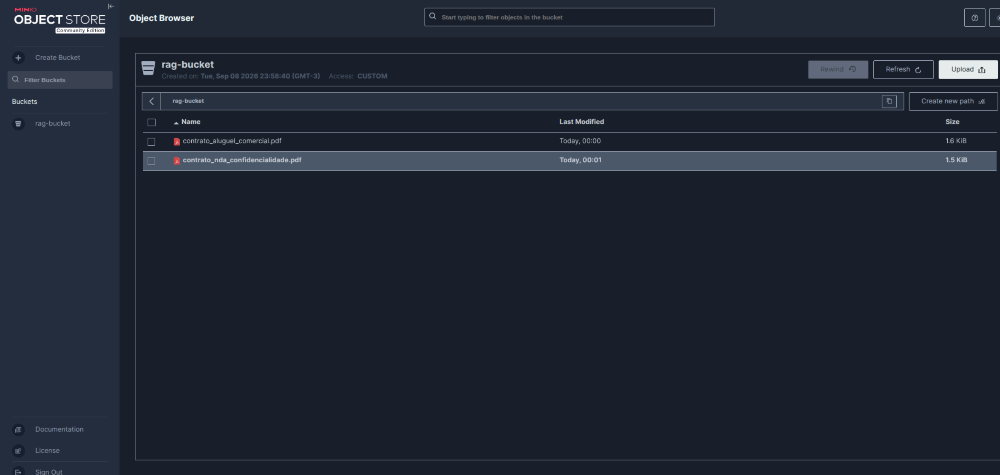
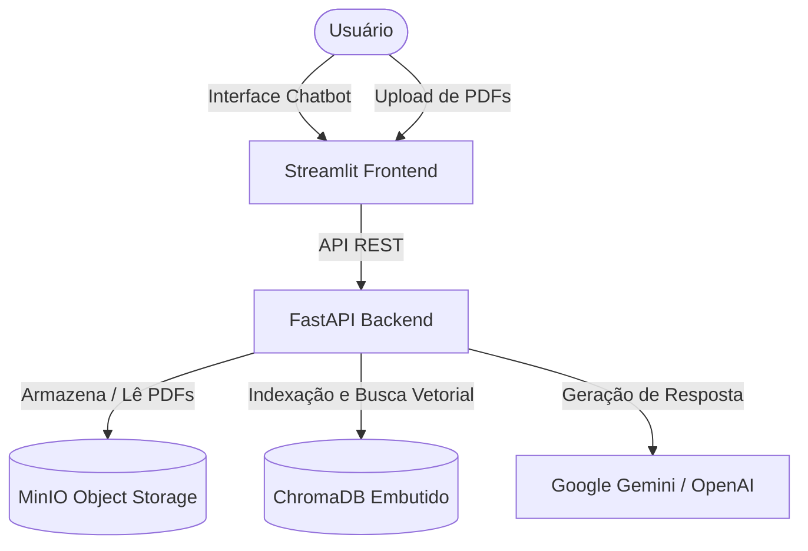

# Assistente RAG com MinIO, FastAPI e Streamlit


> ⚠️ **Aviso de Isenção / Disclaimer:** Todos os dados, nomes de empresas, valores e documentos de contrato apresentados neste repositório e nas demonstrações são puramente fictícios e utilizados exclusivamente para fins de demonstração técnica e testes do sistema RAG.

---

## 📸 Demonstração do Sistema

### Interface do Chatbot RAG (Streamlit)


### Armazenamento de Objetos S3 (MinIO Console)


---

## 📌 Objetivo do Projeto

Este repositório contém a implementação de um pipeline de **Retrieval-Augmented Generation (RAG)** para leitura, indexação semântica e consulta de documentos em formato PDF.

O fluxo de dados é estruturado da seguinte forma:
1. Os arquivos PDF enviados pelo usuário são armazenados em um servidor de objetos S3 (**MinIO**).
2. O backend em **FastAPI** extrai o texto das páginas dos PDFs, divide o conteúdo em blocos (*chunks*) e gera embeddings vetoriais salvos no **ChromaDB**.
3. O frontend em **Streamlit** fornece uma interface gráfica de chat para envio de perguntas. A cada consulta, o sistema busca os trechos mais relevantes por similaridade cosseno no ChromaDB e envia o contexto recuperado para um modelo de linguagem (**Google Gemini** ou **OpenAI**), que sintetiza a resposta final exibindo as fontes e trechos originais.

---

## 🛠️ Tecnologias Utilizadas

- **Python**: Desenvolvimento do backend e frontend.
- **FastAPI**: API REST para gerenciamento de documentos, chamadas aos modelos e busca RAG.
- **Streamlit**: Interface web conversacional e gerenciamento de uploads.
- **MinIO**: Armazenamento de objetos S3 para os arquivos PDF.
- **ChromaDB**: Banco de dados vetorial para armazenamento de embeddings e busca por similaridade.
- **Google Gemini**: Integração via SDK oficial (`google-genai` e `google-generativeai`) com validação de chave de API em tempo real.
- **OpenAI**: Integração opcional com a API da OpenAI.
- **Docker & Docker Compose**: Containerização e orquestração dos serviços.

---

## 🏗️ Arquitetura do Sistema



---

## 🌐 URLs e Portas dos Serviços

| Serviço | URL | Descrição |
| :--- | :--- | :--- |
| 💬 **Streamlit Frontend** | [http://localhost:8501](http://localhost:8501) | Interface gráfica de usuário |
| ⚡ **FastAPI Backend (Swagger)** | [http://localhost:8001/docs](http://localhost:8001/docs) | Endpoints REST e documentação interativa |
| 🗄️ **MinIO Console Web** | [http://localhost:9001](http://localhost:9001) | Painel visual do MinIO (usuário/senha: `minioadmin`) |
| 🔌 **MinIO S3 API** | [http://localhost:9000](http://localhost:9000) | Endpoint S3 |

---

## 🚀 Como Executar o Projeto

### 1. Pré-requisitos
- Docker e Docker Compose instalados.

### 2. Execução via Docker Compose
No diretório raiz do repositório, execute:

```bash
docker-compose up --build
```

O comando irá construir as imagens do backend e frontend, inicializar o container do MinIO e configurar o bucket `rag-bucket`.

---

## 🧪 Passos de Teste

1. **Acessar a Interface:**
   Navegue até [http://localhost:8501](http://localhost:8501).

2. **Gerar PDFs de Exemplo (Opcional):**
   Para gerar 3 contratos de teste na pasta `exemplos_contratos/`, execute:
   ```bash
   python3 generate_contracts.py
   ```

3. **Configurar Chave de API:**
   - Informe a chave de API do **Google Gemini** ou **OpenAI** na barra lateral.
   - Clique em **`⚡ Validar Chave de Ativação`** para testar a comunicação com a API.

4. **Enviar Arquivo PDF:**
   - Faça upload de um arquivo PDF no painel lateral para enviá-lo ao MinIO e iniciar a indexação.

5. **Enviar Perguntas no Chat:**
   - Formule perguntas sobre o conteúdo dos PDFs indexados e visualize a resposta gerada com as citações das fontes.
